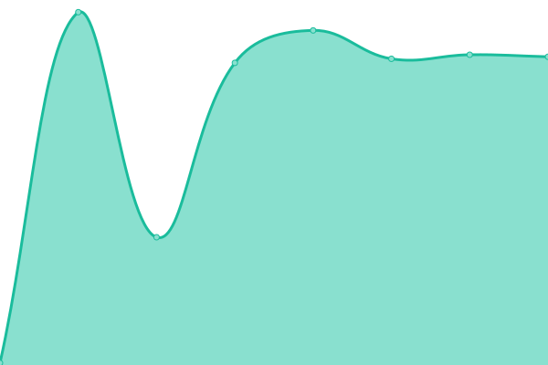
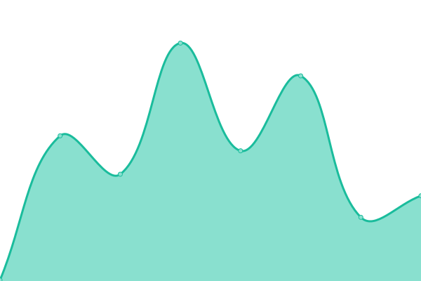
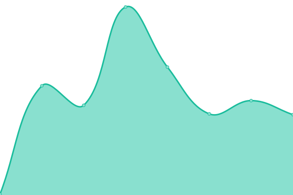

# [📈 Live Status](https://status.adadapted.com): <!--live status--> **🟩 All systems operational**

This repository contains the open-source uptime monitor and status page for [adadaptedinc](https://status.adadapted.com), powered by [Upptime](https://github.com/upptime/upptime).

With [Upptime](https://upptime.js.org), you can get your own unlimited and free uptime monitor and status page, powered entirely by a GitHub repository. We use [Issues](https://github.com/adadaptedinc/upptime-production/issues) as incident reports, [Actions](https://github.com/adadaptedinc/upptime-production/actions) as uptime monitors, and [Pages](https://status.adadapted.com) for the status page.

<!--start: status pages-->
<!-- This summary is generated by Upptime (https://github.com/upptime/upptime) -->
<!-- Do not edit this manually, your changes will be overwritten -->
<!-- prettier-ignore -->
| URL | Status | History | Response Time | Uptime |
| --- | ------ | ------- | ------------- | ------ |
|  [AdAdapted Direct](https://direct.adadapted.com) | 🟩 Up | [ad-adapted-direct.yml](https://github.com/adadaptedinc/upptime-production/commits/HEAD/history/ad-adapted-direct.yml) | 

 82ms
     
 | 

<a href="https://status.adadapted.com/history/ad-adapted-direct">100.00%</a>
    

|  [AdAdapted Circulars](https://circulars.adadapted.com) | 🟩 Up | [ad-adapted-circulars.yml](https://github.com/adadaptedinc/upptime-production/commits/HEAD/history/ad-adapted-circulars.yml) | 

 69ms
     
 | 

<a href="https://status.adadapted.com/history/ad-adapted-circulars">100.00%</a>
    

|  AdAdapted Direct Reporting API | 🟩 Up | [ad-adapted-direct-reporting-api.yml](https://github.com/adadaptedinc/upptime-production/commits/HEAD/history/ad-adapted-direct-reporting-api.yml) | 

 86ms
     
 | 

<a href="https://status.adadapted.com/history/ad-adapted-direct-reporting-api">100.00%</a>
    

|  AdAdapted Direct Service API | 🟩 Up | [ad-adapted-direct-service-api.yml](https://github.com/adadaptedinc/upptime-production/commits/HEAD/history/ad-adapted-direct-service-api.yml) | 

 48ms
     
 | 

<a href="https://status.adadapted.com/history/ad-adapted-direct-service-api">100.00%</a>
    

|  Circular API | 🟩 Up | [circular-api.yml](https://github.com/adadaptedinc/upptime-production/commits/HEAD/history/circular-api.yml) | 

 47ms
     
 | 

<a href="https://status.adadapted.com/history/circular-api">100.00%</a>
    

|  Telemetry API | 🟩 Up | [telemetry-api.yml](https://github.com/adadaptedinc/upptime-production/commits/HEAD/history/telemetry-api.yml) | 

 79ms
     
 | 

<a href="https://status.adadapted.com/history/telemetry-api">100.00%</a>
    

<!--end: status pages-->

[**Visit our status website →**](https://status.adadapted.com)

## 📄 License

- Powered by: [Upptime](https://github.com/upptime/upptime)
- Code: [MIT](./LICENSE) © [adadaptedinc](https://status.adadapted.com)
- Data in the `./history` directory: [Open Database License](https://opendatacommons.org/licenses/odbl/1-0/)
